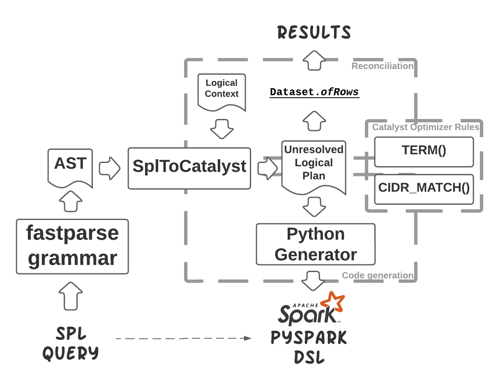
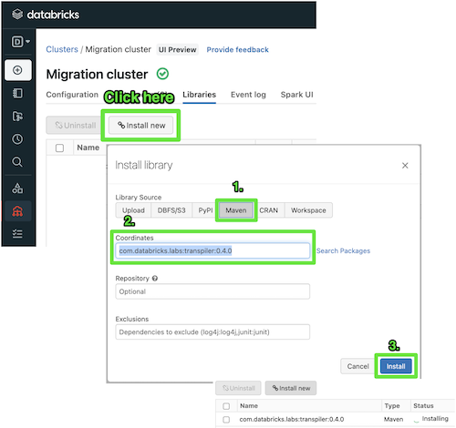
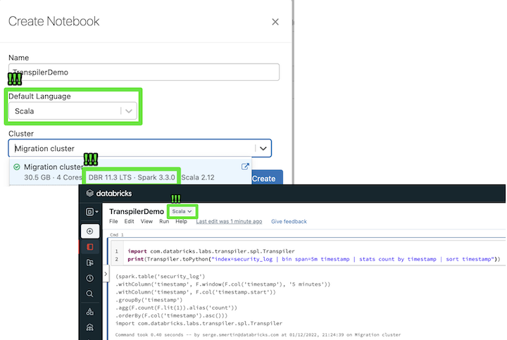

# SPL-to-PySpark transpiler

[](https://codecov.io/gh/databrickslabs/transpiler)
[]([https://codecov.io/github/databrickslabs/transpiler](https://github.com/databrickslabs/transpiler))

Cybersecurity practitioners have plenty of ETL or alerting rules coded in Search Processing Language (SPL) to run within some of the industry-standard SIEM environments. In reality, only the most common commands are used the most by SIEM practitioners, and it’s possible to automatically translate them into corresponding PySpark Structured Streaming or, even later - Spark SQL so that we get the same results on the same datasets with the same query from both SIEM and Databricks. It’s also possible to use this tooling to teach PySpark equivalents to SIEM practitioners to accelerate their time-to-comfort level with Databricks Lakehouse foundations.



Queries could be manually translated, requiring expert knowledge of SIEM and PySpark (or SQL). It takes a week to translate a dozen queries but may take months to translate hundreds of those. With this cross-compiler, we can cut down migration time from months to weeks or even days and significantly increase the speed of learning for the new Databricks practitioners. Some tools like https://uncoder.io/ or https://github.com/SigmaHQ/sigma translate SIEM into other formats, but none exist so far that translates a vast amount of queries to PySpark or Spark SQL.

Lakehouse is especially useful for historical data analysis where only shallow history of records would be kept on SIEM-based architecture. The ability to translate SQL or Spark-based queries on entire history and combine these queries with advanced analytics capabilities offer cyber analysts a more holistic view of security anomalies, and more accurate detection of advanced persistent threats more full history is needed.

## Language support

There's basic support for the most used commands like `addtotals`, `bin`, `collect`, `convert`, `dedup`, `eval`, `eventstats`, `fields`, `fillnull`, 
`format`, `head`, `inputlookup`, `join`, `lookup`, `makeresults`, `map`, `multisearch`, 
`mvcombine`, `mvexpand`, `regex`, `rename`, `return`, `rex`, `search`, `sort`, `stats`, 
`streamstats`, `table`, `where`.

There's also basic support for functions like `auto()`, `cidr_match()`, `coalesce()`, `count()`, 
`ctime()`, `earliest()`, `if()`, `isnotnull()`, `latest()`, `len()`, `lower()`, `max()`, 
`memk()`, `min()`, `mvappend()`, `mvcount()`, `mvfilter()`, `mvindex()`, `none()`, 
`null()`, `num()`, `replace()`, `rmcomma()`, `rmunit()`, `round()`, `strftime()`, 
`substr()`, `sum()`, `term()`, `values()`. 

## Usage

To use transpiler, please create a Databricks Cluster with **DBR 11.3 LTS**, otherwise functionality won't work. 
Once the cluster is created, navigate to `Libraries` tab and click on `Install new`, pick `Maven`, in coordinates 
field please enter `com.databricks.labs:transpiler:0.4.0`, and click `Install`:



Once installation is done, you can use the `toPython` method from `com.databricks.labs.transpiler.spl.Transpiler` Scala object:



You can use Python as well:

```python
def transpile(query: str):
    """Transpiles a query into PySpark DataFrame DSL"""
    from pyspark.sql import SparkSession
    spark = SparkSession.getActiveSession()
    spl = spark._jvm.com.databricks.labs.transpiler.spl
    code = spl.Transpiler.toPython(query)
    print(code)

transpile('index=security_log | bin span=5m timestamp | stats count by timestamp | sort timestamp')
```

### Cross-Compilation Samples
Query `index=security_log | bin span=5m timestamp | stats count by timestamp | sort timestamp`:

```python
(spark.table('security_log')
.withColumn('timestamp', F.window(F.col('timestamp'), '5 minutes'))
.withColumn('timestamp', F.col('timestamp.start'))
.groupBy('timestamp')
.agg(F.count(F.lit(1)).alias('count'))
.orderBy(F.col('timestamp').asc()))
```

Query `index=security_log | stats count(id) by eventType`:
```python
(spark.table('security_log')
.groupBy('eventType')
.agg(F.count(F.lit('id')).alias('count')))
```

Query `index=security_log | eval len_ip=len(ipAddress), len_mail=len(email) | fields +eventType, len_ip, len_mail | stats sum(len_*) by eventType | sort eventType`:
```python
(spark.table('security_log')
.withColumn('len_ip', F.length(F.col('ipAddress')))
.withColumn('len_mail', F.length(F.col('email')))
.select('eventType', 'len_ip', 'len_mail')
.groupBy('eventType')
.agg(F.sum(F.col('len_ip')).alias('sum'), F.sum(F.col('len_mail')).alias('sum'))
.orderBy(F.col('eventType').asc()))
```

Query `index=security_log | eval len_ip=len(ipAddress), len_mail=len(email) | stats min(len_*) AS min_* by eventType | sort eventType`:
```python
(spark.table('security_log')
.withColumn('len_ip', F.length(F.col('ipAddress')))
.withColumn('len_mail', F.length(F.col('email')))
.groupBy('eventType')
.agg(F.min(F.col('len_ip')).alias('min_ip'), F.min(F.col('len_mail')).alias('min_mail'))
.orderBy(F.col('eventType').asc()))
```

Query `index=security_log | eval len_mail=len(email) | fields +id, eventType, cardNumber, len_mail | stats max(*) AS max_* by eventType | sort eventType`:
```python
(spark.table('security_log')
.withColumn('len_mail', F.length(F.col('email')))
.select(F.col('id'), F.col('eventType'), F.col('cardNumber'), F.col('len_mail'))
.groupBy('eventType')
.agg(F.max(F.col('id')).alias('max_id'),
  F.max(F.col('eventType')).alias('max_eventType'),
  F.max(F.col('cardNumber')).alias('max_cardNumber'),
  F.max(F.col('len_mail')).alias('max_len_mail'))
.orderBy(F.col('eventType').asc()))
```

Query `index=security_log | id > 17 | fields + id, eventType, email, ipAddress`:
```python
(spark.table('security_log')
.where((F.col('id') > F.lit(17)))
.select(F.col('id'), F.col('eventType'), F.col('email'), F.col('ipAddress')))
```

Query `index=security_log | eval array_count=mvcount(array) | where array_count=1 | fields + id, eventType, email, array, array_count`:
```python
(spark.table('security_log')
.withColumn('array_count', F.size(F.col('array')))
.where((F.col('array_count') == F.lit(1)))
.select(F.col('id'), F.col('eventType'), F.col('email'), F.col('array'), F.col('array_count')))
```

Query `index=security_log | eval test = mvfilter(len(array) = 2) | fields + array, test`:
```python
(spark.table('security_log')
.withColumn('test', F.filter(F.col('array'), lambda array: (F.length(array) == F.lit(2))))
.select('array', 'test'))
```

Query `index=security_log | eval test = mvcount(mvfilter(len(array) = 2)) | eval original_count = mvcount(array) | where tonumber(original_count) > tonumber(test) | fields + array, original_count, test`:
```python
(spark.table('security_log')
.withColumn('test', F.size(F.filter(F.col('array'), lambda array: (F.length(array) == F.lit(2)))))
.withColumn('original_count', F.size(F.col('array')))
.where((F.col('original_count').cast('double') > F.col('test').cast('double')))
.select(F.col('array'), F.col('original_count'), F.col('test')))
```

Query `index=security_log | eval email_len = len(email) | id > len(email) - 10 | fields + id, email, email_len`:
```python
(spark.table('security_log')
.withColumn('email_len', F.length(F.col('email')))
.where((F.col('id') > (F.length(F.col('email')) - F.lit(10))))
.select(F.col('id'), F.col('email'), F.col('email_len')))
```

Query `index=security_log | eval test = substr(country, 3) | fields country, test`:
```python
(spark.table('security_log')
.withColumn('test', F.substring(F.col('country'), 3, 2147483647))
.select('country', 'test'))
```

Query `index=security_log | eval test = substr(country, 3, 3) | fields country, test`:
```python
(spark.table('security_log')
.withColumn('test', F.substring(F.col('country'), 3, 3))
.select('country', 'test'))
```

Query `index=security_log | eval test = substr(country, -5) | fields country, test`:
```python
(spark.table('security_log')
.withColumn('test', F.substring(F.col('country'), -5, 2147483647))
.select('country', 'test'))
```

Query `index=security_log | rex "From: <(?<from>.*)> To: <(?<to>.*)>" | fields +_raw, from, to`:
```python
(spark.table('security_log')
.select('_raw')
.withColumn('from', F.regexp_extract(F.col('_raw'), 'From: <(?<from>.*)> To: <(?<to>.*)>', 1))
.withColumn('to', F.regexp_extract(F.col('_raw'), 'From: <(?<from>.*)> To: <(?<to>.*)>', 2))
.select(F.col('_raw'), F.col('from'), F.col('to')))
```

Query `index=security_log | rex "From: <(?<from>.*)> To: <(?<to>.*)>" | fields +from, to`:
```python
(spark.table('security_log')
.select('_raw')
.withColumn('from', F.regexp_extract(F.col('_raw'), 'From: <(?<from>.*)> To: <(?<to>.*)>', 1))
.withColumn('to', F.regexp_extract(F.col('_raw'), 'From: <(?<from>.*)> To: <(?<to>.*)>', 2))
.select(F.col('from'), F.col('to')))
```

Query `index=security_log | fields +id, eventType, country, email | rename country as pays`:
```python
(spark.table('security_log')
.select(F.col('id'), F.col('eventType'), F.col('country'), F.col('email'))
.select(F.col('id'), F.col('eventType'), F.col('country').alias('pays'), F.col('email')))
```

Query `index=security_log | rex "From: <(?<from>.*)> To: <(?<to>.*)>" | fields +from, to | rename from AS emailFrom, to AS emailTo`:
```python
(spark.table('security_log')
.select('_raw')
.withColumn('from', F.regexp_extract(F.col('_raw'), 'From: <(?<from>.*)> To: <(?<to>.*)>', 1))
.withColumn('to', F.regexp_extract(F.col('_raw'), 'From: <(?<from>.*)> To: <(?<to>.*)>', 2))
.select(F.col('from'), F.col('to'))
.select(F.col('from').alias('emailFrom'), F.col('to').alias('emailTo')))
```

Query `index=security_log | rex "From: <(?<from>.*)> To: <(?<to>.*)>" | fields - _raw | return 4 emailFrom=from emailTo=to`:
```python
(spark.table('security_log')
.select('_raw')
.withColumn('from', F.regexp_extract(F.col('_raw'), 'From: <(?<from>.*)> To: <(?<to>.*)>', 1))
.withColumn('to', F.regexp_extract(F.col('_raw'), 'From: <(?<from>.*)> To: <(?<to>.*)>', 2))
.select(F.col('from'), F.col('to'))
.select(F.col('from').alias('emailFrom'), F.col('to').alias('emailTo'))
.limit(4))
```

Query `index=security_log | join type=inner id [search index=enrichment_table] | fields +id, email, user_role`:
```python
(spark.table('security_log')
.join(spark.table('enrichment_table'), ['id'], 'inner')
.select(F.col('id'), F.col('email'), F.col('user_role')))
```

Query `index=security_log | join type=left id [search index=enrichment_table] | fields +id, email, user_role`:
```python
(spark.table('security_log')
.join(spark.table('enrichment_table'), ['id'], 'left_outer')
.select(F.col('id'), F.col('email'), F.col('user_role')))
```

Query `multisearch [index=security_log | id < 2 | fields +id, eventType] [index=enrichment_table | id < 2] [index=security_log | id < 2] | fields +id, eventType, user_role`:
```python
(spark.table('security_log')
.where((F.col('id') < F.lit(2)))
.select('id', 'eventType').unionByName(spark.table('enrichment_table')
.where((F.col('id') < F.lit(2))), allowMissingColumns=True).unionByName(spark.table('security_log')
.where((F.col('id') < F.lit(2))), allowMissingColumns=True)
.select(F.col('id'), F.col('eventType'), F.col('user_role')))
```

Query `index=security_log | fields +email | eval b_not_null=if(isnotnull(email), 1, 0)`:
```python
(spark.table('security_log')
.select('email')
.withColumn('b_not_null', F.when(F.col('email').isNotNull(), F.lit(1)).otherwise(F.lit(0))))
```

Query `index=security_log | eval id_null=if(id > 10, null(), id) | table id id_null`:
```python
(spark.table('security_log')
.withColumn('id_null', F.when((F.col('id') > F.lit(10)), F.lit(None)).otherwise(F.col('id')))
.select('id', 'id_null'))
```

Query `index=security_log_with_double | fields +id, score | fillnull`:
```python
(spark.table('security_log_with_double')
.select(F.col('id'), F.col('score'))
.na.fill('0')
.replace(float('nan'), float(0.0)))
```

Query `index=security_log | fields +id, email | fillnull`:
```python
(spark.table('security_log')
.select(F.col('id'), F.col('email'))
.na.fill('0')
.replace(float('nan'), float(0.0)))
```

Query `index=security_log | fields +id, email | fillnull value=NA`:
```python
(spark.table('security_log')
.select(F.col('id'), F.col('email'))
.na.fill('NA'))
```

Query `index=security_log | fields +id, email, eventType, ipAddress | fillnull value=NA email eventType`:
```python
(spark.table('security_log')
.select(F.col('id'), F.col('email'), F.col('eventType'), F.col('ipAddress'))
.na.fill('NA', ['email', 'eventType']))
```

Query `index=security_log | eval n = len(email) | fields +id, email, eventType, n | eventstats max(n) AS max_n, min(n) by eventType`:
```python
(spark.table('security_log')
.withColumn('n', F.length(F.col('email')))
.select(F.col('id'), F.col('email'), F.col('eventType'), F.col('n'))
.withColumn('max_n', F.max(F.col('n')).over(Window.partitionBy(F.col('eventType')).orderBy(F.col('eventType').asc())))
.withColumn('min(n)', F.min(F.col('n')).over(Window.partitionBy(F.col('eventType')).orderBy(F.col('eventType').asc()))))
```

Query `index=security_log | eval _time=timestamp | streamstats count(_time) AS n | eval cat=if(n < 4, "A","B") | table _time cat n | streamstats max(n) AS max_n, min(n) by cat | streamstats current=false window=2 min(n) AS min_n_lag`:
```python
(spark.table('security_log')
.withColumnRenamed('timestamp', '_time')
.withColumn('n', F.count(F.lit('_time')).over(Window.partitionBy().orderBy(F.col('_time').asc()).rowsBetween(Window.unboundedPreceding, 0)))
.withColumn('cat', F.when((F.col('n') < F.lit(4)), F.lit('A')).otherwise(F.lit('B')))
.select(F.col('_time'), F.col('cat'), F.col('n'))
.withColumn('max_n', F.max(F.col('n')).over(Window.partitionBy(F.col('cat')).orderBy(F.col('_time').asc()).rowsBetween(Window.unboundedPreceding, 0)))
.withColumn('min(n)', F.min(F.col('n')).over(Window.partitionBy(F.col('cat')).orderBy(F.col('_time').asc()).rowsBetween(Window.unboundedPreceding, 0)))
.withColumn('min_n_lag', F.min(F.col('n')).over(Window.partitionBy().orderBy(F.col('_time').asc()).rowsBetween((-1 - 1), -1))))
```

Query `index=security_log | id > 10 | eval min=min(id,15), max=max(id,15) | fields + id, min, max`:
```python
(spark.table('security_log')
.where((F.col('id') > F.lit(10)))
.withColumn('min', F.least(F.col('id'), F.lit(15)))
.withColumn('max', F.greatest(F.col('id'), F.lit(15)))
.select('id', 'min', 'max'))
```

Query `index=security_log | eval static=10 | fields + eventType, static | dedup 1 eventType static`:
```python
(spark.table('security_log')
.withColumn('static', F.lit(10))
.select('eventType', 'static')
.withColumn('_no', F.monotonically_increasing_id())
.withColumn('_rn', F.row_number().over(Window.partitionBy(F.col('eventType'), F.col('static')).orderBy(F.col('_no').asc())))
.where((F.col('_rn') <= F.lit(1)))
.select('eventType', 'static'))
```

Query `inputlookup security_log where id < 3 | fields +id, eventType, email, ipAddress, country`:
```python
(spark.table('security_log')
.where((F.col('id') < F.lit(3)))
.limit(1000000000)
.select(F.col('id'), F.col('eventType'), F.col('email'), F.col('ipAddress'), F.col('country')))
```

Query `inputlookup max=2 security_log where id > 10 | fields +id, eventType, email, ipAddress, country`:
```python
(spark.table('security_log')
.where((F.col('id') > F.lit(10)))
.limit(2)
.select(F.col('id'), F.col('eventType'), F.col('email'), F.col('ipAddress'), F.col('country')))
```

Query `index=security_log | fields +id, eventType, email | format maxresults=2`:
```python
(spark.table('security_log')
.select(F.col('id'), F.col('eventType'), F.col('email'))
.limit(2)
.groupBy()
.agg(F.array_join(F.collect_list(F.format_string('((id=%s) AND (eventType=%s) AND (email=%s))', F.col('id'), F.col('eventType'), F.col('email'))), ' OR ').alias('search')))
```

Query `index=security_log | fields +id, eventType, email | format maxresults=2 "[" "[" "&&" "]" "||" "]"`:
```python
(spark.table('security_log')
.select(F.col('id'), F.col('eventType'), F.col('email'))
.limit(2)
.groupBy()
.agg(F.array_join(F.collect_list(F.format_string('[[id=%s] && [eventType=%s] && [email=%s]]', F.col('id'), F.col('eventType'), F.col('email'))), ' || ').alias('search')))
```

Query `index=security_log | fields +id, country | mvcombine id`:
```python
(spark.table('security_log')
.select(F.col('id'), F.col('country'))
.groupBy('country')
.agg(F.collect_list(F.col('id')).alias('id')))

```

Query `index=security_log | fields +id, country | mvcombine delim=";" id`:
```python
(spark.table('security_log')
.select(F.col('id'), F.col('country'))
.groupBy('country')
.agg(F.array_join(F.collect_list(F.col('id')), ';').alias('id')))
```

Query `index=security_log | fields +id, array | mvexpand array | where id=1`:
```python
(spark.table('security_log')
.select(F.col('id'), F.col('array'))
.select(F.col('id'), F.explode(F.col('array')).alias('array'))
.where((F.col('id') == F.lit(1))))
```

Query `index=security_log | fields +id, array | mvexpand array limit=1 | where id=1`:
```python
(spark.table('security_log')
.select(F.col('id'), F.col('array'))
.select(F.col('id'), F.explode(F.expr('slice(array, 1, 1)')).alias('array'))
.where((F.col('id') == F.lit(1))))
```

Query `makeresults count=5 annotate=t server_group="group1" | fields - _time`:
```python
(spark.range(0, 5, 1)
.withColumn('_raw', F.lit(None))
.withColumn('_time', F.current_timestamp())
.withColumn('host', F.lit(None))
.withColumn('source', F.lit(None))
.withColumn('sourcetype', F.lit(None))
.withColumn('server', F.lit('local'))
.withColumn('server_group', F.lit(None))
.select(F.col('_raw'),
  F.col('_time'),
  F.col('host'),
  F.col('source'),
  F.col('sourcetype'),
  F.col('server'),
  F.col('server_group'))
.select(F.col('_raw'), F.col('host'), F.col('source'), F.col('sourcetype'), F.col('server'), F.col('server_group')))
```

Query `index=security_log | id < 5 | eval in_range = if(cidrmatch("109.177.0.0/16", ipAddress),1,0) | fields +id, ipAddress, in_range`:
```python
(spark.table('security_log')
.where((F.col('id') < F.lit(5)))
.withColumn('in_range', F.when(F.expr("cidr_match('109.177.0.0/16', ipAddress)"), F.lit(1)).otherwise(F.lit(0)))
.select(F.col('id'), F.col('ipAddress'), F.col('in_range')))
```

Query `index=security_log | id < 5 | ipAddress=109.177.0.0/16 | fields +id, ipAddress`:
```python
(spark.table('security_log')
.where((F.col('id') < F.lit(5)))
.where(F.expr("cidr_match('109.177.0.0/16', ipAddress)"))
.select('id', 'ipAddress'))
```

Query `index=security_log | id < 5 | eval quant=round((id/3),2), unit=if(id < 3, "M", "G") | eval size=quant.unit, memk=memk(size) | fields +id, size, memk`:
```python
(spark.table('security_log')
.where((F.col('id') < F.lit(5)))
.withColumn('quant', F.round((F.col('id') / F.lit(3)), 2))
.withColumn('unit', F.when((F.col('id') < F.lit(3)), F.lit('M')).otherwise(F.lit('G')))
.withColumn('size', F.concat(F.col('quant'), F.col('unit')))
.withColumn('memk', (F.regexp_extract(F.col('size'), '(?i)^(\\d*\\.?\\d+)([kmg])$', 1).cast('double') * F.when((F.upper(F.regexp_extract(F.col('size'), '(?i)^(\\d*\\.?\\d+)([kmg])$', 2)) == F.lit('K')), F.lit(1.0))
.when((F.upper(F.regexp_extract(F.col('size'), '(?i)^(\\d*\\.?\\d+)([kmg])$', 2)) == F.lit('M')), F.lit(1024.0))
.when((F.upper(F.regexp_extract(F.col('size'), '(?i)^(\\d*\\.?\\d+)([kmg])$', 2)) == F.lit('G')), F.lit(1048576.0))
.otherwise(F.lit(1.0))))
.select(F.col('id'), F.col('size'), F.col('memk')))
```

Query `index=security_log | id < 5 | eval unit=if(id < 3, "Megabyte", "GB") | eval size=id.unit, rmunit=rmunit(size) | fields +id, size, rmunit`:
```python
(spark.table('security_log')
.where((F.col('id') < F.lit(5)))
.withColumn('unit', F.when((F.col('id') < F.lit(3)), F.lit('Megabyte')).otherwise(F.lit('GB')))
.withColumn('size', F.concat(F.col('id'), F.col('unit')))
.withColumn('rmunit', F.regexp_extract(F.col('size'), '(?i)^(\\d*\\.?\\d+)(\\w*)$', 1).cast('double'))
.select(F.col('id'), F.col('size'), F.col('rmunit')))
```

Query `index=security_log | id < 5 | eval s=substr(ipAddress,1,3).",".substr(ipAddress, 5, 2) | eval n=rmcomma(s) | fields +id, s, n`:
```python
(spark.table('security_log')
.where((F.col('id') < F.lit(5)))
.withColumn('s', F.concat(F.substring(F.col('ipAddress'), 1, 3), F.concat(F.lit(','), F.substring(F.col('ipAddress'), 5, 2))))
.withColumn('n', F.regexp_replace(F.col('s'), ',', '').cast('double'))
.select('id', 's', 'n'))
```

Query `index=security_log | id < 3 | convert timeformat="%H" ctime(timestamp) AS hour | fields +id, timestamp, hour`:
```python
(spark.table('security_log')
.where((F.col('id') < F.lit(3)))
.withColumn('hour', F.date_format(F.col('timestamp'), 'HH'))
.select(F.col('id'), F.col('timestamp'), F.col('hour')))
```

Query `index=security_log | id < 3 | convert ctime(timestamp) AS ctime | fields +id, timestamp, ctime`:
```python
(spark.table('security_log')
.where((F.col('id') < F.lit(3)))
.withColumn('ctime', F.date_format(F.col('timestamp'), 'MM/dd/yyyy HH:mm:ss'))
.select(F.col('id'), F.col('timestamp'), F.col('ctime')))
```

Query `index=security_log | id < 3 | fields +id, cardType, cardNumber | convert num(card*) none(cardType)`:
```python
(spark.table('security_log')
.where((F.col('id') < F.lit(3)))
.select(F.col('id'), F.col('cardType'), F.col('cardNumber'))
.select(F.col('id'),
  F.col('cardType'),
  F.when(F.date_format(F.col('cardNumber').cast('string'), 'MM/dd/yyyy HH:mm:ss').isNotNull(), F.date_format(F.col('cardNumber').cast('string'), 'MM/dd/yyyy HH:mm:ss'))
.when(F.col('cardNumber').cast('double').isNotNull(), F.col('cardNumber').cast('double'))
.when((F.regexp_extract(F.col('cardNumber'), '(?i)^(\\d*\\.?\\d+)([kmg])$', 1).cast('double') * F.when((F.upper(F.regexp_extract(F.col('cardNumber'), '(?i)^(\\d*\\.?\\d+)([kmg])$', 2)) == F.lit('K')), F.lit(1.0))
.when((F.upper(F.regexp_extract(F.col('cardNumber'), '(?i)^(\\d*\\.?\\d+)([kmg])$', 2)) == F.lit('M')), F.lit(1024.0))
.when((F.upper(F.regexp_extract(F.col('cardNumber'), '(?i)^(\\d*\\.?\\d+)([kmg])$', 2)) == F.lit('G')), F.lit(1048576.0))
.otherwise(F.lit(1.0))).isNotNull(), (F.regexp_extract(F.col('cardNumber'), '(?i)^(\\d*\\.?\\d+)([kmg])$', 1).cast('double') * F.when((F.upper(F.regexp_extract(F.col('cardNumber'), '(?i)^(\\d*\\.?\\d+)([kmg])$', 2)) == F.lit('K')), F.lit(1.0))
.when((F.upper(F.regexp_extract(F.col('cardNumber'), '(?i)^(\\d*\\.?\\d+)([kmg])$', 2)) == F.lit('M')), F.lit(1024.0))
.when((F.upper(F.regexp_extract(F.col('cardNumber'), '(?i)^(\\d*\\.?\\d+)([kmg])$', 2)) == F.lit('G')), F.lit(1048576.0))
.otherwise(F.lit(1.0))))
.when(F.regexp_extract(F.col('cardNumber'), '(?i)^(\\d*\\.?\\d+)(\\w*)$', 1).cast('double').isNotNull(), F.regexp_extract(F.col('cardNumber'), '(?i)^(\\d*\\.?\\d+)(\\w*)$', 1).cast('double'))
.when(F.regexp_replace(F.col('cardNumber'), ',', '').cast('double').isNotNull(), F.regexp_replace(F.col('cardNumber'), ',', '').cast('double'))
.alias('cardNumber')))
```

Query `index=security_log | id < 3 | fields +id, ipAddress, cardType, cardNumber | convert auto(*) none(i*)`:
```python
(spark.table('security_log')
.where((F.col('id') < F.lit(3)))
.select(F.col('id'), F.col('ipAddress'), F.col('cardType'), F.col('cardNumber'))
.select(F.col('id'),
  F.col('ipAddress'),
  F.when(F.date_format(F.col('cardType').cast('string'), 'MM/dd/yyyy HH:mm:ss').isNotNull(), F.date_format(F.col('cardType').cast('string'), 'MM/dd/yyyy HH:mm:ss'))
.when(F.col('cardType').cast('double').isNotNull(), F.col('cardType').cast('double'))
.when((F.regexp_extract(F.col('cardType'), '(?i)^(\\d*\\.?\\d+)([kmg])$', 1).cast('double') * F.when((F.upper(F.regexp_extract(F.col('cardType'), '(?i)^(\\d*\\.?\\d+)([kmg])$', 2)) == F.lit('K')), F.lit(1.0))
.when((F.upper(F.regexp_extract(F.col('cardType'), '(?i)^(\\d*\\.?\\d+)([kmg])$', 2)) == F.lit('M')), F.lit(1024.0))
.when((F.upper(F.regexp_extract(F.col('cardType'), '(?i)^(\\d*\\.?\\d+)([kmg])$', 2)) == F.lit('G')), F.lit(1048576.0))
.otherwise(F.lit(1.0))).isNotNull(), (F.regexp_extract(F.col('cardType'), '(?i)^(\\d*\\.?\\d+)([kmg])$', 1).cast('double') * F.when((F.upper(F.regexp_extract(F.col('cardType'), '(?i)^(\\d*\\.?\\d+)([kmg])$', 2)) == F.lit('K')), F.lit(1.0))
.when((F.upper(F.regexp_extract(F.col('cardType'), '(?i)^(\\d*\\.?\\d+)([kmg])$', 2)) == F.lit('M')), F.lit(1024.0))
.when((F.upper(F.regexp_extract(F.col('cardType'), '(?i)^(\\d*\\.?\\d+)([kmg])$', 2)) == F.lit('G')), F.lit(1048576.0))
.otherwise(F.lit(1.0))))
.when(F.regexp_extract(F.col('cardType'), '(?i)^(\\d*\\.?\\d+)(\\w*)$', 1).cast('double').isNotNull(), F.regexp_extract(F.col('cardType'), '(?i)^(\\d*\\.?\\d+)(\\w*)$', 1).cast('double'))
.when(F.regexp_replace(F.col('cardType'), ',', '').cast('double').isNotNull(), F.regexp_replace(F.col('cardType'), ',', '').cast('double'))
.otherwise(F.col('cardType')).alias('cardType'),
  F.col('cardNumber'))
.select(F.col('id'),
  F.col('ipAddress'),
  F.when(F.date_format(F.col('cardType').cast('string'), 'MM/dd/yyyy HH:mm:ss').isNotNull(), F.date_format(F.col('cardType').cast('string'), 'MM/dd/yyyy HH:mm:ss'))
.when(F.col('cardType').cast('double').isNotNull(), F.col('cardType').cast('double'))
.when((F.regexp_extract(F.col('cardType'), '(?i)^(\\d*\\.?\\d+)([kmg])$', 1).cast('double') * F.when((F.upper(F.regexp_extract(F.col('cardType'), '(?i)^(\\d*\\.?\\d+)([kmg])$', 2)) == F.lit('K')), F.lit(1.0))
.when((F.upper(F.regexp_extract(F.col('cardType'), '(?i)^(\\d*\\.?\\d+)([kmg])$', 2)) == F.lit('M')), F.lit(1024.0))
.when((F.upper(F.regexp_extract(F.col('cardType'), '(?i)^(\\d*\\.?\\d+)([kmg])$', 2)) == F.lit('G')), F.lit(1048576.0))
.otherwise(F.lit(1.0))).isNotNull(), (F.regexp_extract(F.col('cardType'), '(?i)^(\\d*\\.?\\d+)([kmg])$', 1).cast('double') * F.when((F.upper(F.regexp_extract(F.col('cardType'), '(?i)^(\\d*\\.?\\d+)([kmg])$', 2)) == F.lit('K')), F.lit(1.0))
.when((F.upper(F.regexp_extract(F.col('cardType'), '(?i)^(\\d*\\.?\\d+)([kmg])$', 2)) == F.lit('M')), F.lit(1024.0))
.when((F.upper(F.regexp_extract(F.col('cardType'), '(?i)^(\\d*\\.?\\d+)([kmg])$', 2)) == F.lit('G')), F.lit(1048576.0))
.otherwise(F.lit(1.0))))
.when(F.regexp_extract(F.col('cardType'), '(?i)^(\\d*\\.?\\d+)(\\w*)$', 1).cast('double').isNotNull(), F.regexp_extract(F.col('cardType'), '(?i)^(\\d*\\.?\\d+)(\\w*)$', 1).cast('double'))
.when(F.regexp_replace(F.col('cardType'), ',', '').cast('double').isNotNull(), F.regexp_replace(F.col('cardType'), ',', '').cast('double'))
.otherwise(F.col('cardType')).alias('cardType'),
  F.when(F.date_format(F.col('cardNumber').cast('string'), 'MM/dd/yyyy HH:mm:ss').isNotNull(), F.date_format(F.col('cardNumber').cast('string'), 'MM/dd/yyyy HH:mm:ss'))
.when(F.col('cardNumber').cast('double').isNotNull(), F.col('cardNumber').cast('double'))
.when((F.regexp_extract(F.col('cardNumber'), '(?i)^(\\d*\\.?\\d+)([kmg])$', 1).cast('double') * F.when((F.upper(F.regexp_extract(F.col('cardNumber'), '(?i)^(\\d*\\.?\\d+)([kmg])$', 2)) == F.lit('K')), F.lit(1.0))
.when((F.upper(F.regexp_extract(F.col('cardNumber'), '(?i)^(\\d*\\.?\\d+)([kmg])$', 2)) == F.lit('M')), F.lit(1024.0))
.when((F.upper(F.regexp_extract(F.col('cardNumber'), '(?i)^(\\d*\\.?\\d+)([kmg])$', 2)) == F.lit('G')), F.lit(1048576.0))
.otherwise(F.lit(1.0))).isNotNull(), (F.regexp_extract(F.col('cardNumber'), '(?i)^(\\d*\\.?\\d+)([kmg])$', 1).cast('double') * F.when((F.upper(F.regexp_extract(F.col('cardNumber'), '(?i)^(\\d*\\.?\\d+)([kmg])$', 2)) == F.lit('K')), F.lit(1.0))
.when((F.upper(F.regexp_extract(F.col('cardNumber'), '(?i)^(\\d*\\.?\\d+)([kmg])$', 2)) == F.lit('M')), F.lit(1024.0))
.when((F.upper(F.regexp_extract(F.col('cardNumber'), '(?i)^(\\d*\\.?\\d+)([kmg])$', 2)) == F.lit('G')), F.lit(1048576.0))
.otherwise(F.lit(1.0))))
.when(F.regexp_extract(F.col('cardNumber'), '(?i)^(\\d*\\.?\\d+)(\\w*)$', 1).cast('double').isNotNull(), F.regexp_extract(F.col('cardNumber'), '(?i)^(\\d*\\.?\\d+)(\\w*)$', 1).cast('double'))
.when(F.regexp_replace(F.col('cardNumber'), ',', '').cast('double').isNotNull(), F.regexp_replace(F.col('cardNumber'), ',', '').cast('double'))
.otherwise(F.col('cardNumber')).alias('cardNumber')))
```

Query `index=security_log | id < 3 | eval date = strftime(timeStamp, "%m/%d/%Y %H:%M:%S") | eval hour=strftime("2021-11-05 21:20:32", "%H") | fields +id, date, hour`:
```python
(spark.table('security_log')
.where((F.col('id') < F.lit(3)))
.withColumn('date', F.date_format(F.col('timeStamp'), 'MM/dd/yyyy HH:mm:ss'))
.withColumn('hour', F.date_format(F.lit('2021-11-05 21:20:32'), 'HH'))
.select('id', 'date', 'hour'))
```

Query `index=security_log | eval anotherNum=10 | fields +id, eventType, anotherNum | addtotals fieldname=my_total`:
```python
(spark.table('security_log')
.withColumn('anotherNum', F.lit(10))
.select(F.col('id'), F.col('eventType'), F.col('anotherNum'))
.withColumn('my_total', (F.when(F.col('anotherNum').cast('double').isNotNull(), F.col('anotherNum')).otherwise(F.lit(0.0)) + (F.when(F.col('eventType').cast('double').isNotNull(), F.col('eventType')).otherwise(F.lit(0.0)) + F.when(F.col('id').cast('double').isNotNull(), F.col('id')).otherwise(F.lit(0.0))))))
```

Query `index=security_log | map search="search index=enrichment_table id=$id$"`:
```python
(spark.table('enrichment_table')
.limit(10).alias('l')
.join(spark.table('security_log').alias('r'),
(F.col('l.id') == F.col('r.id')), 'left_semi'))
```

### Overriding `_time`, `_raw` and index names

Your Delta Lake may have other column names containing timestamps and raw records, so you can override those by 
setting the following spark conf values from code or cluster config:

```
spark.conf.set("spl.field._time", "ts")
spark.conf.set("spl.field._raw", "json")
spark.conf.set("spl.index", "custom_table")
```

## Featured on

* [Cutting the Edge in Fighting Cybercrime: Reverse-Engineering a Search Language to Cross-Compile to PySpark](https://www.youtube.com/watch?v=y8rKzRaM7c4) at DATA+AI Summit 2022
* [Accidentally Building a Petabyte-Scale Cybersecurity Data Mesh in Azure With Delta Lake](https://www.youtube.com/watch?v=G9x-1s-1TJI) at DATA+AI Summit 2022


### Project Support
Please note that all projects in the `databrickslabs` github space are provided for your exploration only, and are not formally supported by Databricks with Service Level Agreements (SLAs). They are provided AS-IS and we do not make any guarantees of any kind. Please do not submit a support ticket relating to any issues arising from the use of these projects.

Any issues discovered through the use of this project should be filed as [GitHub Issues](https://github.com/databrickslabs/transpiler/issues) on the Repo. They will be reviewed as time permits, but there are no formal SLAs for support.
